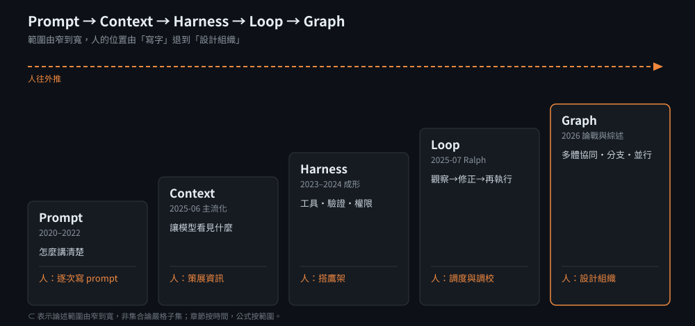

# Prompt → Loop → Graph：把人往外推的發展史

> 主線：每一層都是因為上一層撐不住任務複雜度，才被逼出來；而每上一層，人就往外退一步，從「寫字的人」變成「設計組織的人」。關係是超集，不是取代：Prompt ⊂ Context ⊂ Harness ⊂ Loop ⊂ Graph。這裡的 ⊂ 指論述關注範圍由窄到寬（表達→輸入→設施→流程→組織），不是集合論的嚴格子集，層與層之間互有交疊。
>
> 閱讀提醒：公式按「範圍」排序，章節按「時間」排序，兩者不完全同序（Context 主流化晚於 Harness 論述，所以 §3 Harness 在 §4 Context 之前）。

## 五層一覽

| 層 | 管什麼 | 人的位置 | 撐不住的點 |
| --- | --- | --- | --- |
| Prompt | 怎麼表達任務 | 逐次寫 prompt 的人 | 模型看不見的東西還是看不見 |
| Context | 讓模型看見什麼 | 策展資訊的人 | 管得再好，仍是一次跑完就結束 |
| Harness | 工具、執行環境、驗證、權限 | 搭鷹架的人 | 有設施，但沒人定義「反覆做到對為止」 |
| Loop | 觀察、行動、驗證、修正的循環 | 調度與調校的人 | 主迴圈單進程，難以多體協同與並行 |
| Graph | 多 agent 的組織、狀態與路由 | 設計組織的人 | 協調成本、debug 難度、並行衝突 |

## 時間軸總覽

| 時間 | 里程碑 | 解決什麼 | 撐不住的點 |
| --- | --- | --- | --- |
| 2020-05 | [RAG 論文](https://arxiv.org/abs/2005.11401)（Lewis et al.） | 模型參數記不住、知識無法更新 | 只解決知識，沒解決講清楚 |
| 2020 | GPT-3 few-shot，Prompt Engineering 萌芽 | 單次輸入→單次輸出的品質 | 看不見的東西還是看不見 |
| 2022-01 | [Chain-of-Thought](https://arxiv.org/abs/2201.11903)（Wei et al.） | 複雜推理需要中間步驟 | 一次跑完，幻覺與誤差傳播 |
| 2022-10 | [ReAct](https://arxiv.org/abs/2210.03629)（Yao et al.） | Thought→Action→Observation，可調工具 | 小規模 loop，無獨立驗證 |
| 2023-03 | [AutoGPT](https://github.com/Significant-Gravitas/AutoGPT) / BabyAGI：第一波全自主 loop | 人只給目標，系統自行拆解執行 | 無 Harness／Context 地基，不可控而退燒 |
| 2023-03 | [Reflexion](https://arxiv.org/abs/2303.11366) / [Self-Refine](https://arxiv.org/abs/2303.17651) | 輸出後自己審查修正 | 單人 loop，無結構化狀態、無協同 |
| 2023-06 | [OpenAI Function Calling](https://openai.com/index/function-calling-and-other-api-updates/) | 模型輸出結構化工具呼叫，調用工具有標準介面 | 各家介面不一，無跨廠生態 |
| 2024-11 | [MCP 發布](https://modelcontextprotocol.io/) | 工具介面標準化 | 只有介面，沒有組織方式 |
| 2024-12 | Anthropic [Building Effective Agents](https://www.anthropic.com/engineering/building-effective-agents) | workflows vs agents 分類：prompt chaining、routing、parallelization、orchestrator-workers、evaluator-optimizer | 路徑寫死或靠人在中間傳話 |
| 2025-06 | Anthropic [multi-agent research system](https://www.anthropic.com/engineering/multi-agent-research-system)（06-13）；Cognition [Don't Build Multi-Agents](https://cognition.com/blog/dont-build-multi-agents)（06-12） | 正反兩方：orchestrator-worker 並行探索 vs 單執行緒共享完整 context | 前者要處理狀態與 checkpoint，後者放棄並行 |
| 2025-06 | [Context Engineering 開始主流化](https://simonwillison.net/2025/Jun/27/context-engineering/)（Lütke → Karpathy → Willison） | 從怎麼說，變成該讓模型看見什麼 | 管得再好，仍是一次跑完就結束 |
| 2025-07 | [Ralph Wiggum 技巧](https://ghuntley.com/ralph/)（Geoffrey Huntley） | `while :; do cat PROMPT.md \| claude-code ; done`，系統自己跑，人退到調度者 | 主迴圈單進程、無局部重試、無結構化狀態 |
| 2025-09 | Anthropic [Effective context engineering for AI agents](https://www.anthropic.com/engineering/effective-context-engineering-for-ai-agents)（09-29） | 把 context 當有限資源：compaction、結構化筆記、sub-agent | 仍是單一 agent 的內部管理 |
| 2025-11 | Anthropic [Effective harnesses for long-running agents](https://www.anthropic.com/engineering/effective-harnesses-for-long-running-agents)（11-26） | 跨 context window 的長任務：initializer、進度檔、feature list、git 紀律 | 設計焦點仍在單一 agent 的接力 |
| 2024–2026（技術→論述） | Graph 編排框架（LangGraph、AutoGen 等）→ 2026 年中 Graph Engineering 論戰與綜述 | 多 agent 協同、並行、分支路由、斷點續跑 | 論述新，技術早已存在 |

## 1. Prompt Engineering（2020–2022）：怎麼講清楚

做法：角色設定、few-shot 範例、[CoT](https://arxiv.org/abs/2201.11903) 思維鏈。公式：單次輸入→單次輸出。

人的位置：每次親自措辭、試錯、調 prompt。

極限：模型看不見的東西還是看不見；複雜任務靠一次生成，幻覺無解。（RAG 在這個階段出現，但它補的是「知識」而非「表達」，概念上屬於 §4 的 Context。）

## 2. ReAct 與 Reflection（2022–2023）：最小的 Loop

[ReAct](https://arxiv.org/abs/2210.03629) = Reasoning + Acting。以 Thought→Action→Observation 循環調用工具（如 Wikipedia API），在 HotpotQA、FEVER 上緩解 CoT 幻覺，在 ALFWorld、WebShop 超越 imitation / RL baseline。

Reflection（[Reflexion](https://arxiv.org/abs/2303.11366)、[Self-Refine](https://arxiv.org/abs/2303.17651)）則是單人版 Loop：輸出後自己審查、修正再定稿。Andrew Ng 把它與 Planning、Tool Use、Multi-agent 並列為 agentic design pattern（見 [DeepLearning.AI 課程](https://deeplearning.ai/courses/agentic-ai/)）。

共同局限：規模小、無獨立驗證子系統、無結構化狀態。

## 3. Harness 地基（2023–2024）：模型之外的鷹架

三塊地基陸續到位：

- [Function Calling](https://openai.com/index/function-calling-and-other-api-updates/)（2023-06-13）：模型能輸出結構化的工具呼叫，「調用工具」第一次有了標準形狀，但各家介面不一。
- [MCP](https://modelcontextprotocol.io/)（2024-11）：工具的 USB-C，Harness 的介面層。官方公告見 [Anthropic MCP 發布](https://www.anthropic.com/news/model-context-protocol)。
- [Building Effective Agents](https://www.anthropic.com/engineering/building-effective-agents)（2024-12-19）：Anthropic 給出實務分類，workflows（prompt chaining、routing、parallelization、orchestrator-workers、evaluator-optimizer）vs agents（模型動態指揮）。建議從 LLM API 做起，框架只省 boilerplate，過度抽象難 debug。（Anthropic 已在原文加註：2024-12 以來環境持續演進，後續發展另見其新文章。）

公式（作者整理）：Agent = Model + Harness。Harness = 權重之外的一切：工具、執行環境、記憶、沙盒、驗證迴圈、權限邊界。

「Harness」作為詞語，可舉證的官方用例是 Anthropic 2025-11 的 [Effective harnesses for long-running agents](https://www.anthropic.com/engineering/effective-harnesses-for-long-running-agents)：用 initializer agent 建好環境、進度檔與 feature list，再讓 coding agent 逐 session 接力。概念成形在 2024，詞語主流化在 2025 後半，與 Context 的情形類似。

人的位置：不再逐次寫 prompt，而是搭好工具、沙盒、驗證與權限。

## 4. Context Engineering（2025-06）：該讓模型看見什麼

[Tobi Lütke 表示偏好此詞，Karpathy 放大討論，Simon Willison 記錄](https://simonwillison.net/2025/Jun/27/context-engineering/)。Karpathy 定義："filling the context window with just the right information for the next step"。內容含 RAG、few-shot、工具描述、state / history、compacting。

Willison 的觀察：prompt engineering 被誤解為打字進 chatbot 的 pretentious 詞，context engineering 的 inferred definition 更接近本意。時間語義：Willison 原文說的是該詞 "recently started to gain traction"，即此詞並非 2025-06 新造，該時點是它開始成為主流論述。

Anthropic 2025-09 的 [Effective context engineering for AI agents](https://www.anthropic.com/engineering/effective-context-engineering-for-ai-agents) 把它講得更工程化：context 是有限資源、報酬遞減，目標是找出「最小的高訊號 token 集合」；長任務用三招：compaction（壓縮歷史後重開視窗）、結構化筆記（外部持久記憶）、sub-agent（各自處理再回傳摘要）。

工程上兩門必修：[Context Rot](https://research.trychroma.com/context-rot)（Chroma 技術報告，2025-07；無關上下文太多反而變差，需壓縮裁剪）、Memory（跨 session 持久化）。概念上 Context 是 Harness 的部件，雖然它開始主流化的時間晚於 Harness 論述。

人的位置：策展者，決定每一步讓模型看到什麼。

極限：上下文管得再好，仍是一次跑完就結束。

## 5. Loop Engineering（技巧 2025-07，命名為社群追述）：把人拿掉

把人在中間傳話拆掉，改成執行→觀察→評估→修正→再執行。

自動化 loop 並非 2025 年才有：2023 年 AutoGPT / BabyAGI 是第一波全自主 loop，Anthropic 2024 年的 evaluator-optimizer 也已把獨立驗證寫成迴圈。早期 loop 撐不住，正是因為當時還缺 Harness 與 Context 的地基；Ralph 的位置，是把這件事變成明確、可複製的技巧與論述。

代表案例 [Ralph Wiggum](https://ghuntley.com/ralph/)（Huntley，2025-07-14）：

- 純粹形態就是 bash loop，單體 monolith、單 repo、單進程，每輪只做一件事，且由 Ralph 自己決定最重要的一件事。
- 每輪 deterministic 分配相同 stack：plan（`fix_plan.md`）+ specs（事先與 agent 長談寫出的規格）。
- 主迴圈雖單進程，搜尋與寫入階段可派出大量 subagent，但 build / test 驗證只收斂為一個。
- 作者自述："deterministically bad in an undeterministic world"；"Ralph gets tuned - like a guitar"，靠看 stream 找壞模式來調 prompt。

「Loop Engineering」作為詞語，2026 年 6–8 月有大量中英文媒體報導與技術彙整（例如 [Analytics Vidhya 的 Harness vs Loop vs Graph 指南](https://www.analyticsvidhya.com/blog/2026/08/agent-harness-loop-graph-engineering/)），可見它在 2026 年中已成主流論述；最早出處仍待查。

人的位置：調度者與調校者，設定目標與 gate，看輸出調 prompt。

局限：主迴圈單進程、無局部重試、缺結構化狀態。toy loop 與 production loop 的分界在有無程式化 verifier / gate。

## 6. Graph Engineering（技術 2024，命名 2026）：一個 loop 不夠用

### 什麼時候需要

當任務要多 agent 協同、並行、分支路由、斷點續跑、人機協同，就把任務建模成有向圖（節點、邊、結構化狀態）。

### 技術前身

圖式編排不是 2026 年發明的。LangGraph 2024 年已存在（官方發布 2024-01-17，文件現於 [docs.langchain.com](https://docs.langchain.com/oss/python/langgraph/overview)）；AutoGen、MetaGPT（皆 2023-08 論文）、CrewAI 等多 agent 框架更早已存在。Anthropic 2025-06 的 [multi-agent research system](https://www.anthropic.com/engineering/multi-agent-research-system) 則是 orchestrator-worker 的生產案例：lead agent 擬策略、並行派出 subagent；他們也自述 agent 有狀態且易出錯，需要 resume-from-checkpoint 與完整 tracing。

### 2026 年的命名與論述

- 2026-07-18：Peter Steinberger 在 X 上問 "Are we still talking loops or did we shift to graphs yet?" 引發論戰。
- 同日：Hamel Husain 發表〈Loop Engineering Is Dead. Enter Graph Engineering.〉（[TDS 事件記錄](https://towardsdatascience.com/graph-engineering-for-ai-agents-from-prompts-and-loops-to-workflows/)）。
- 2026-08-21：系統性綜述 [arXiv:2608.21156](https://arxiv.org/abs/2608.21156)（*Graph Engineering in the Era of LLM Agents: From Individual Intelligence to System Intelligence*），其摘要正以 Prompt / Context / Harness / Loop / Graph Engineering 排出本篇同一條鏈。

### Loop → Graph 的代價

- 並行隔離：並行改同一檔案會互蓋，需 sub-agent 隔離或 worktree 再合併。
- 狀態與斷點：節點間要有結構化狀態，失敗後要能從 checkpoint 續跑。
- 可觀測性：多體互動的 debug 比單一 loop 困難得多，需要完整 tracing。
- 成本與協調開銷：agent 越多，token 與溝通成本越高。
- 多體不必然更好：Cognition 主張單執行緒、共享完整 context 的線性 agent 作為預設，因為並行 agent 的行動各自帶著隱含決策，容易互相衝突。Graph 適合「可分解、可並行、廣度型」的任務，不是萬用解。

人的位置：設計組織者，定義角色、邊、共享狀態，以及人工介入點。

## 7. 超集關係與 XX 已死

本鏈是概念範圍的排序，不是編年；例外已於各節標註。

Prompt 管怎麼表達任務；Context 決定讓模型看見什麼；Harness 接上可執行環境與回饋；Loop 定義反覆觀察行動驗證恢復；Graph 編排多體組織。

2026 年中 loops vs graphs 論戰的起點，是〈Loop Engineering Is Dead. Enter Graph Engineering.〉這類標題，隨後也出現「loop 沒有死」的反駁與各方解讀。類似句式過去也常見（例如 "prompt engineering is dead"、"RAG is dead"），多半是標題噱頭，實際發展往往是舊層被吸收為新層的部件，而不是消失。

## 8. 什麼時候該升級到下一層

原則：能停在低層就停在低層。Anthropic 的 Building Effective Agents 也建議從最簡單的做法開始。

| 現象 | 該往哪走 |
| --- | --- |
| 輸出品質不穩，但模型有足夠資訊 | 留在 Prompt：改指令、加範例 |
| 模型缺資訊，或輸入太長導致變差 | 升到 Context：檢索、裁剪、壓縮、記憶 |
| 需要動手做事、取得回饋 | 升到 Harness：工具、沙盒、驗證、權限 |
| 需要多輪「做→驗→修」，且有程式化的驗證標準 | 升到 Loop：先確認 verifier / gate 存在 |
| 任務可拆解並行、需要分支路由、斷點續跑或人機協同，單一 loop 已是瓶頸 | 升到 Graph：同時預期狀態、debug、成本的代價 |

實例：[Hermes Agent 架構](../hermes/architecture.md)（Loop、Self evolution、Security check 的區分與 broker 隔離設計）。

## 9. 驗證基準與限制

- 已驗證日期：RAG 2020-05-22、CoT 2022-01-28、ReAct 2022-10-06、Function Calling 2023-06-13、LangGraph 官方發布 2024-01-17、Anthropic Building Effective Agents 2024-12-19、Cognition 2025-06-12、Anthropic multi-agent 2025-06-13、Willison 2025-06-27、Ralph 2025-07-14、Context Rot 2025-07-14、Anthropic context engineering 2025-09-29、Anthropic harnesses 2025-11-26、X 論戰起點 2026-07-18（由 X snowflake ID 反推，UTC）、Graph Engineering 綜述 2026-08-21。
- 命名時間屬社群論述、敘事框架，不是學術斷代。Graph Engineering 的論戰與綜述已可舉證（見 §6）；Loop / Harness 作為詞語的最早出處仍未能獨立驗證。
- 尚未獨立核實：Hamel Husain 文章的確切日期與全文、TDS 文章內容、arXiv 摘要全文；引用前建議回原文確認。

## 核心來源

- [Lewis et al., RAG, arXiv:2005.11401](https://arxiv.org/abs/2005.11401)
- [Wei et al., CoT, arXiv:2201.11903](https://arxiv.org/abs/2201.11903)
- [Yao et al., ReAct, arXiv:2210.03629](https://arxiv.org/abs/2210.03629)（[專案頁](https://react-lm.github.io)）
- [Shinn et al., Reflexion, arXiv:2303.11366](https://arxiv.org/abs/2303.11366)
- [Madaan et al., Self-Refine, arXiv:2303.17651](https://arxiv.org/abs/2303.17651)
- [OpenAI, Function calling and other API updates, 2023-06-13](https://openai.com/index/function-calling-and-other-api-updates/)
- [Anthropic, Building Effective Agents, 2024-12-19](https://www.anthropic.com/engineering/building-effective-agents)
- [MCP 官方文件](https://modelcontextprotocol.io/)
- [Anthropic, How we built our multi-agent research system, 2025-06-13](https://www.anthropic.com/engineering/multi-agent-research-system)
- [Cognition (Walden Yan), Don't Build Multi-Agents, 2025-06-12](https://cognition.com/blog/dont-build-multi-agents)
- [Simon Willison, Context engineering, 2025-06-27](https://simonwillison.net/2025/Jun/27/context-engineering/)
- [Geoffrey Huntley, Ralph Wiggum as a "software engineer", 2025-07-14](https://ghuntley.com/ralph/)
- [Chroma, Context Rot: How Increasing Input Tokens Impacts LLM Performance, 2025-07-14](https://research.trychroma.com/context-rot)
- [Anthropic, Effective context engineering for AI agents, 2025-09-29](https://www.anthropic.com/engineering/effective-context-engineering-for-ai-agents)
- [Anthropic, Effective harnesses for long-running agents, 2025-11-26](https://www.anthropic.com/engineering/effective-harnesses-for-long-running-agents)
- [Graph Engineering in the Era of LLM Agents, arXiv:2608.21156, 2026-08-21](https://arxiv.org/abs/2608.21156)
- [Nhu Hoang, Graph Engineering for AI Agents: From Prompts and Loops to Workflows, Towards Data Science, 2026-09-14](https://towardsdatascience.com/graph-engineering-for-ai-agents-from-prompts-and-loops-to-workflows/)

## 延伸追蹤（挑 2–3 個固定看即可）

| 用途 | 來源 |
| --- | --- |
| 論文 | [arXiv](https://arxiv.org)、[Hugging Face Papers](https://huggingface.co/papers) |
| 官方 | [Anthropic Engineering](https://www.anthropic.com/engineering)、[MCP Docs](https://modelcontextprotocol.io/) |
| 趨勢彙整 | [Import AI](https://importai.substack.com)、[State of AI Report](https://www.stateof.ai) |
| 社群討論 | [Hacker News](https://news.ycombinator.com) |
