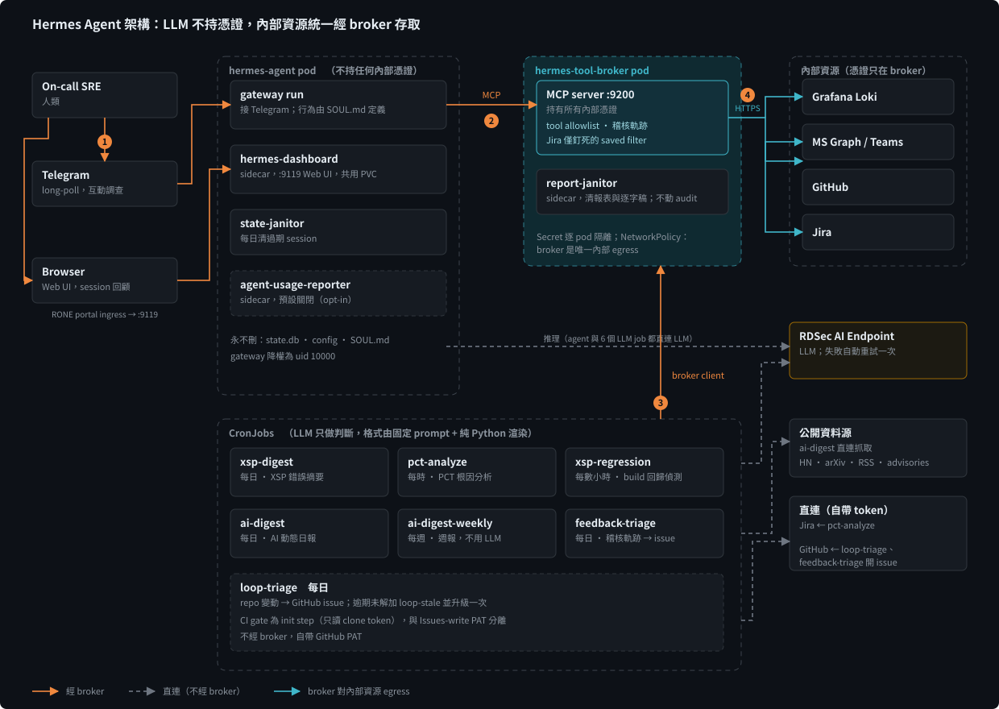

# Hermes Agent 架構與設計

> 個人 AI 助手 / AI Lab / AI 瑞士刀。部署於 RDSec RONE（Kubernetes）。
> 本文聚焦**設計概念與架構決策**；個別 job 的參數細節以各自 repo 的 docs 為準。

## 1. 背景與目標

- 定位：一個可用自然語言操作的個人 AI 助手，同時承載每日／每時的自動化報表與稽核。
- 三個相關概念的區分（設計時的思考基礎）：
  - **Loop engineering**：runtime 任務解決機制，在規範好的範圍與邊界內以「計畫 → 執行 → 測試 → 修正 → 評估」循環自主工作。
  - **Self evolution**：訓練／最佳化階段的能力升級機制，與 loop 不同層級。
  - **Security check**：確保 loop 不會失控的安全閥。

## 2. 核心設計原則

1. **LLM 不持有憑證。** 所有對內部資源的呼叫都經由 Tool Broker（MCP server），LLM 只能「提出請求」。
2. **確定性的事交給程式，語意的事交給 LLM。** 排程 job 用固定 system prompt + 純 Python 的格式化／解析，輸出穩定可預期。
3. **最小權限、逐元件隔離。** Secret 逐 pod 隔離，NetworkPolicy 讓 broker 成為唯一的內部 egress。
4. **失敗就失敗，不貼半截。** Job 失敗一律 `sys.exit(1)`，不發出不完整的報告。
5. **從自己的稽核軌跡學習。** 系統把自身被拒絕／出錯的紀錄轉成改善提案，形成回饋迴圈。
6. **長跑部署要能自我清理，但不誤刪關鍵狀態。**

## 3. 整體架構

橘色實線是經 broker 的呼叫，灰色虛線是不經 broker 的直連（LLM 推理、公開資料、自帶 token 的 Jira／GitHub），青色線是 broker 對內部資源的 egress。編號依序是：① 人透過 Telegram／Web UI 進來，② agent 以 MCP 呼叫 broker，③ CronJob 以 broker client 身分呼叫，④ broker 持憑證對內部資源 egress。

資料流的重點：

- **互動路徑**：人 → Telegram → `hermes-agent` → broker（MCP）→ 內部資源。
- **排程路徑**：CronJob → LLM（RDSec）做分析／摘要，需要內部資源時經 broker，結果送到 Teams。
- **觀察路徑**：Web dashboard 提供 session 回顧。Telegram 上看似連貫的對話，dashboard 內會切成獨立 session。

## 4. 元件職責

### 4.1 常駐 Pod

| 元件 | 職責 | 設計要點 |
| --- | --- | --- |
| `hermes-agent` | 自然語言介面，接 Telegram，使用 RDSec LLM | 不持任何內部憑證；行為由 `SOUL.md`（系統提示）定義 |
| `hermes-tool-broker` | MCP server，內部資源的**單一出口** | 持有 Loki／Graph／GitHub／Jira 憑證；tool allowlist；所有呼叫留稽核軌跡 |

### 4.2 Sidecar

| Sidecar | 所在 Pod | 職責 |
| --- | --- | --- |
| `hermes-dashboard` | agent | Web UI（config／sessions），與 gateway 分離程序、共用 PVC；認證閘可選配 |
| `state-janitor` | agent | 每日清過期 session |
| `agent-usage-reporter` | agent（預設關閉） | 唯讀 `state.db`，估算 LLM 用量並回報 broker |
| `report-janitor` | broker | 每日清過期報表與逐字稿 |

### 4.3 CronJob

| Job | 頻率 | 用途 | 與 broker 的關係 |
| --- | --- | --- | --- |
| `xsp-digest` | 每日 | XSP 錯誤摘要 → Teams | 純 broker client |
| `pct-analyze` | 每時 | PCT 案件根因分析 → Teams | Jira 自帶 token；GitHub／Loki／Teams 經 broker |
| `xsp-regression` | 每數小時 | Build regression sentinel | Loki 查詢與 Teams 經 broker |
| `ai-digest` | 每日 | AI 工程趨勢日報 → Teams | 公開資料直連；發送／歷史／計費經 broker |
| `ai-digest-weekly` | 每週 | 日報的週報彙整 | 只讀 broker 歷史；**不用 LLM** |
| `feedback-triage` | 每日 | 分析稽核軌跡，提出改善 issue | 稽核讀取經 broker；開 issue 自帶 PAT |
| `loop-triage` | 每日 | repo 變動 → GitHub issue、逾期升級 | 不經 broker，自帶 PAT；內含 CI gate init step |

## 5. 設計重點

### 5.1 Guardrails 與安全：三層分離

把「LLM agent」「Tool MCP」「Cron job」分開，各自設定護城河。

- **憑證隔離**：agent 沒有憑證；k8s Secret 逐 pod 隔離；NetworkPolicy 讓 broker 成為唯一內部 egress。
- **容器降權**：gateway 以 root 啟動修正 `/run` 權限後降為非特權使用者（uid 10000）；dashboard sidecar 全程以 uid 10000 執行。
- **Skill 拆分**：Skill 本質上是 prompt + script 的混合體。為了安全，把既有 skill 拆開——判斷與對話留在 LLM agent，會碰憑證與外部系統的腳本放進 Tool MCP。
- **範圍收斂**：能力刻意設計得窄，例如 Jira 只讀一個**釘死的 saved filter**，不開放任意 JQL；預設 DENIED，需明確開關才啟用。
- **Multi-model council（Claude／GPT／Gemini 協作）**：opt-in 且 fail-closed。需明確啟用，且互動 agent 只在使用者明確要求時才呼叫；排程 job 各自有獨立開關，預設仍是單一模型。

### 5.2 CronJob 輸出一致

核心思路：**讓 LLM 只負責「內容判斷」，其餘流程與格式全部用程式固定。**

- 六個 LLM job 共用同一份 bundle 與 `llm.py`。
- 固定 system prompt + 純 Python 的 `render_*` / `parse_*`，輸出格式穩定。
- `ai-digest-weekly` 是刻意的例外：完全不用 LLM，以先前記錄的 trusted metadata 做決定式渲染。
- 所有 LLM job 與 usage reporter 都回報 token／成本到 broker（`record_usage`），彙總後供趨勢追蹤。成本是 client 端估算，並非帳單數字；broker 本身不持 LLM key。
- 失敗即 `sys.exit(1)`，不貼半截結果。

### 5.3 Resilience

短暫故障不該讓對話或排程直接失敗：

- LLM 端偶發的快速失敗（timeout 類）：互動 agent 走同模型 fallback，cron job 走共用 `llm.chat()` 自動重試一次。
- Broker 執行腳本時，遇暫時性 Loki 後端錯誤重試一次；殘留 traceback 收斂成最後一行，避免把整串 stack 洩漏到 Denied 訊息。

### 5.4 LLM agent 作為人機界面

- 用自然語言操作，選擇 Telegram 是因為介面比 MS Teams 好用。
- 報表推送（單向、給 DRI）走 Teams；互動調查（雙向）走 Telegram。兩種通道各取所長。
- 典型情境：Telegram 上請 agent 查 error 細節 → 依調查結果追問是否與近期 PCT case 有關。

### 5.5 Self evolution by feedback

從「自己的使用紀錄」長出改善清單，而不是讓模型自我修改：

- `feedback-triage` 讀 broker 稽核軌跡（DENIED／ERROR 與 tool-call chain 的形狀），由 LLM 產生改善提案並自動開 GitHub issue；內容指紋不變則不重複留言。
- `loop-triage` 追蹤 open issue，逾期未解加標籤並升級一次。
- 實例：feedback-triage 發現 agent 連續誤用 region／env 參數，催生兩次 `SOUL.md` 修正——先補「成對使用並讀 DENIED 訊息重試」，再釐清兩套區碼詞彙的差異。
- 這是一個**人在迴圈內**的演化：系統提案，人決定是否採納。

### 5.6 Purge

- 定期清理過期 session、報表、逐字稿，避免長跑下撐爆 PVC。
- **永不刪除**：`state.db`、config、`SOUL.md`、稽核軌跡。

## 6. 值得記下的設計手法

- **證據導向的分析**：`pct-analyze` 不只靠程式碼推論，會從案件文字擷取租戶識別，撈實際 log 佐證；查無證據時退回純程式碼路徑。
- **Regression sentinel 的判定邏輯**：以「曝光量足夠」與「訊號新穎」兩個條件共同決定 verdict，並用凍結快照避免部署後乾淨窗口造成誤判；同一 (build, signature) 只 alert 一次，預設安靜。
- **CI gate 併入 triage**：gate 作為 init step 以只讀 clone token 跑檢查、結果透過共用 volume 交給 triage step；clone token 與 Issues-write PAT 分離，降低單一憑證的爆炸半徑。
- **Vendored skill 版本管理**：來源分 marketplace plugin（版本釘死）與上游 repo（追蹤 `main`）；腳本於 build 時凍進 bundle，執行期不對外抓取。Broker 自寫的動詞則屬本身程式碼。

## 7. 取捨與限制

- LLM 主導的排程本質上不穩定，因此走「固定流程 + LLM 只做判斷」；代價是每個 job 都要寫較多確定性程式。
- 追蹤上游 `main` 的 skill 帶來版本漂移風險，換取免維護 patch。
- 用量成本為估算值，不等同帳單。
- 多數 job 綁定特定服務（Loki 標籤、Jira filter、Teams chat），移植到別的系統需要人工調整。

## 8. 後續方向

| 方向 | 說明 |
| --- | --- |
| Multi-model debate | 已上線（`multi_council`），持續觀察在各 job 的價值 |
| Auto fix | 同時看得到 repo 與 application log，能否自動定位問題並開 Jira／Issue／PR |
| Highlight new error | 用 log 中的 build version 欄位，搭配 PR 與 4xx／5xx，提早發現新 build 造成的問題（部分已由 regression sentinel 實現） |
| 可否成為 template | 只需指向「logs + source code + 案件 filter」就能運作？還是特化部分仍需大量人工調整——待驗證 |
