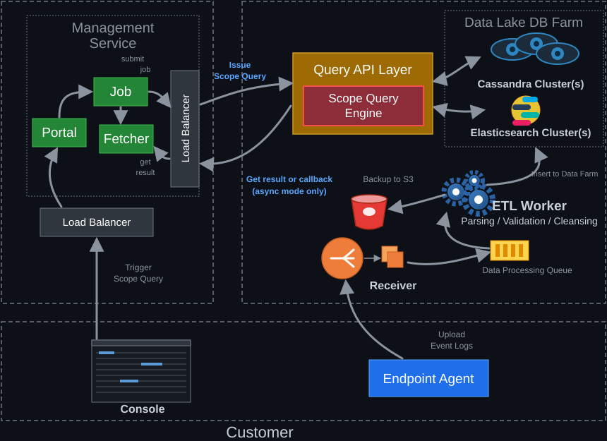

# 端點遙測資料收集與範圍查詢架構

這是我過去工作中參與過的系統架構，產品與元件名稱已改成通用說法，只保留架構與設計取捨。裝在客戶端的 Endpoint Agent 會把事件記錄（telemetry logs）上傳到雲端，經過整理後存進資料湖。之後可以查詢某個指標影響了哪些端點。

下半部是寫入路徑：Endpoint Agent 上傳 telemetry logs，經 Receiver、Queue、ETL Worker 進到資料湖。上半部是讀取路徑：管理服務透過 Load Balancer 對 Query API 發出查詢，結果同步回傳，或以 callback 非同步通知。

## 兩條路徑

寫入。 Endpoint Agent 把事件記錄上傳到 Receiver。Receiver 收下後放進 Data Processing Queue，由 ETL Worker 取出做解析、驗證，再寫進 Cassandra 與 Elasticsearch。ETL Worker 也會把資料備份到 S3。

讀取。 使用者在 Console 觸發範圍查詢，請求經 Load Balancer 到管理服務的 Portal，再由 Job 元件建立 job。Fetcher 負責取回結果。Job 元件透過另一層 Load Balancer 對 Query API Layer 送出 scope query，由 Scope Query Engine 向 Cassandra 與 Elasticsearch 查詢。非同步模式下，結果由 callback 回傳。

## 兩個設計重點

### Receiver 用 Go 撰寫

Receiver 要在短時間內收下大量 agent 持續送上來的 telemetry logs，流量大而且集中。這一層用 Golang 寫，goroutine 輕量，可以用很少的資源同時處理大量連線，編譯成單一執行檔也方便部署與水平擴充。

Receiver 只負責快速收下並放進 queue，解析與清洗留給後面的 ETL Worker，這樣收件端不會被慢的處理拖住，ETL 也能依 queue 的積壓量獨立擴充。

### 依查詢行為混用兩種儲存

同一份資料依查詢方式存進兩個系統，各自做它擅長的事。

| 查詢行為 | 儲存 | 原因 |
| --- | --- | --- |
| 關鍵字搜尋、模糊比對 | Elasticsearch | 倒排索引適合全文與關鍵字檢索 |
| 用 hash / ID 精準取回 | Cassandra | 依 partition key 定位，讀寫延遲穩定，容易水平擴充 |

代價是同一份資料要寫兩次，ETL Worker 得負責兩邊的一致性。這個成本換來的是每種查詢都走最適合的索引，不必讓單一資料庫兼顧所有存取模式。
